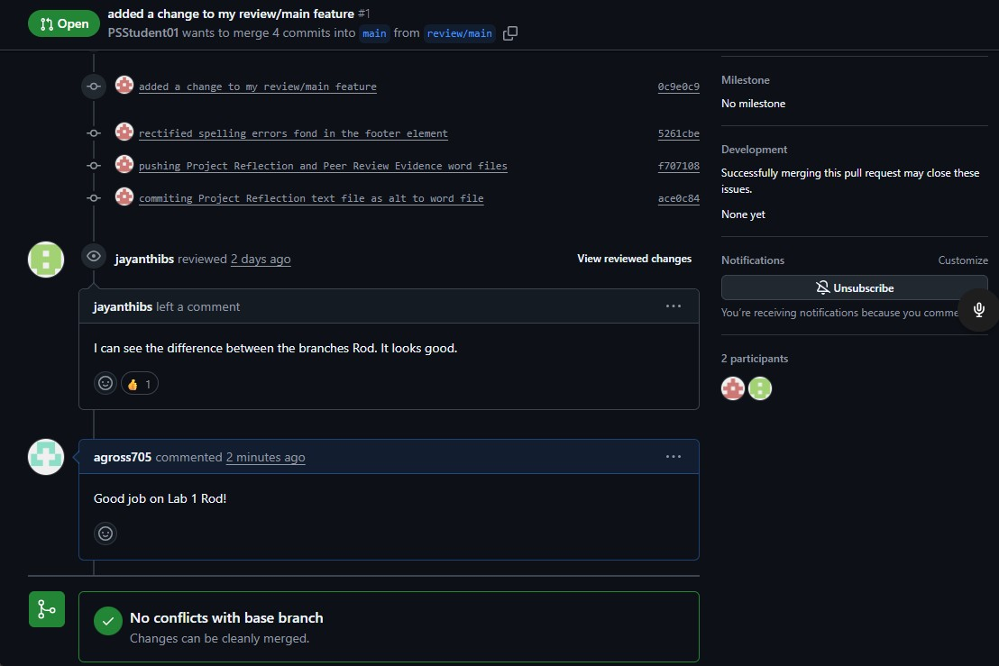

# Module 302 | Mod 1 | SBA 1.1: Version Control

## Table of contents

- [Overview](#overview)
  - [The challenge](#the-challenge)
  - [Screenshot](#screenshot)
  - [Links](#links)
- [My process](#my-process)
  - [Deliverables](#deliverables)
  - [What I learned](#what-i-learned)
  - [Continued development](#continued-development)
  - [Useful resources](#useful-resources)
- [Author](#author)
- [Acknowledgments](#acknowledgments)

## Overview

In this assessment, you will apply the skills you’ve learned throughout the Version Control module in a real-world Git project simulation. This project will challenge your ability to manage branches, handle merge conflicts, submit pull requests, and collaborate with others using GitHub.

You will set up a GitHub repository, work with branches, simulate team collaboration by resolving conflicts, and submit pull requests. The final deliverable will include the link to your GitHub repository and a reflection on the steps you followed to complete the project.

### The challenge

- Set Up the Repository
- Create and Manage Branches
- Simulate a Merge Conflict
- Submit a Pull Request and Review Peers' Work

### Screenshot

### Links

- SBA Assignment URL: https://ps-lms.vercel.app/curriculum/se/302/sba
- GitHub Repository URL: https://github.com/agross705/vcs-ash

## My process

- The steps I took to create and manage branches?
    ~ Created the repo remotely and cloned it
    ~ Created an index.html file to act as the main and staged & committed the file
    ~ Created two local branches [feature/header & feature/footer] and tracked local changes by staging & commiting each respectively

- How I handled the merge conflict?
    ~ Merged main with feature/footer without issues
    ~ Merged feature/header into main which resulted in a conflict
    ~ Resolved the conflict by choosing which changes I wanted to commit
    ~ Staged & commited the resolved index.html

- How the pull request helped to ensure code quality and collaboration?
    ~ Created a review/main branch to enable a pull request to the main index.html
    ~ Set up a changed title pull request to allow collaboration review/comments to ensure code quality

### Deliverables

- GitHub Repository link
- Project Reflection
- Peer Review Evidence

### What I learned

This project enhanced my undeerstanding of how git manages branches and keeps track of history within workflows. It clarified the differences between local and remote repositories and how braches can work independently in each. Overall, this project boosted my confidence in using git commands and showcased how organized version control can effectively support teamwork while keeping the code in great shape.

### Continued development

I will make it a priority to consistently apply my knowledge of version control in all of my future projects, ensuring that I leverage this essential skill effectively. Moreover, I am committed to expanding my understanding of git commands in a comprehensive manner, so that their usage becomes second nature to me. This way, I will be able to navigate through various tasks with confidence, without the need to constantly refer back to my notes for reassurance, ultimately streamlining my workflow and enhancing my productivity.

### Useful resources

- GitHub’s introduction to Git | https://docs.github.com/en/get-started/using-git/about-git#basic-git-commands
  Basic Git commands

## Author
agross705

## Acknowledgments
Quinn Shannon | Helped to gain understanding of where I was making a mistake & correct it.